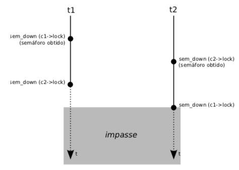
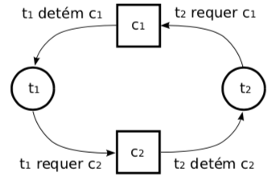
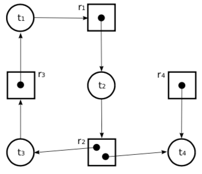

# [](#header-1) Sistemas operacionais : Gerência de atividades :

## Sumário

1. Introdução
2. Caracterização de impasses
3. Grafos de alocação de recursos
4. Técnicas de tratamento de impasses

### [](#intro) 1. Introdução

**controle da concorrência** : implica em suspender algumas tarefas enquantro outras acessam os recursos compartilhados de forma a garantir a consistência das tarefas e dos recursos.

**impasse** ou _deadlock_ é quando as tarefas envolvidas ficam bloqueadas aguardando liberação de recursos indefinidamente.

**exemplo** transferência entre conta bancária

```c
typedef struct conta_t {
  int saldo;   // saldo atual da conta
  sem_t lock ; // semáforo associado à conta
  ...          // outras informações da conta
};

void transferir (conta_t* contaDeb, conta_t* contaCred, int valor) {
  sem_down (contaDeb->lock) ;      // obtém acesso a contaDeb
  sem_down (contaCred->lock) ;     // obtém acesso a contCred
  if (contaDeb->saldo >= valor) {
    contaDeb->saldo -= valor ;     // debita valor de contaDeb
    contaCred->saldo += valor ;    // credita valor em contaCred
  }
  sem_up (contaDeb->lock) ;        // libera acesso a contaDeb
  sem_up (contaCred->lock) ;       // libera acesso a contaCred
}
```



### [](#caracterizacao) 2. Caracterização de impasses

**Formalmente** um conjunto de _N_ tarefas se encontram em um impasse se cada uma das tarefas aguarda um evento que somente outra tarefa do conjunto poderá produzir.

**4 condições** são necessárias:

1. (C1) Exclusão mútua
2. (C2) Posse e espera
3. (C3) Não preempção
4. (C4) Espera circular

**observações**:

- as 4 condições são necessárias para a formação de impasses;
- na inexistência de pelo menos uma das 4 condições, não existe impasse;
- a verificação apenas das 4 condições NÃO garante a existência de impasse.

### [](#alocacao-recursos) 3. Grafos de alocação de recursos

**Grafos de alocação de recursos** é uma forma de representa a alocação de recursos entre as tarefas.

- tarefas representadas por círculos;
- recursos representados por quadrados;
- quantidade de instâncias do recurso, representados por pontos dentro do quadrado.





### [](#tratamento) 4. Técnicas de tratamento de impasses

**Tipos** de técnicas de tratamento:

- **prevenir** impasses através de regras rígidas;
  - buscam garantir que impasses nunca possam ocorrer no sistema
  - garantir pelo menos a inexistência de 1 das condições
- **impedir** impasses por meio do contínuo acompanhamento da alocação de recursos;
  - acompanhar previamente a alocação de recursos
  - algum algoritmo de previsão que detecte se a alocação levará a uma condição de impasse
  - Normalmente é necessário conhecer previamente que recursos a tarefa irá acessar
  - Algotitmo do banqueiro por Dijkstra, 1965, é o mais conhecido
- **detectar e resolver** impasses
  - Nenhuam medida preventiva é adotada
  - **Algoritmo de detecção** normalmente mantendo grafo de alocação de recursos e aplicando uma análise no grafo
  - **Resolução** elimando tarefas ou retrocedendo o estado das tarefas
- **Ignorar** os impasses
  - Devido ao custo de _overhead_ nos algoritmos de prevenção, impedimento ou detecção, simplesmente aceita que irá acontecer
  - Terceiriza para a aplicação tratar o impasse

## Bibliografia

- Sistemas operacionais: conceitos e mecanismos, Capítulo 4, Seção 10 Impasses
