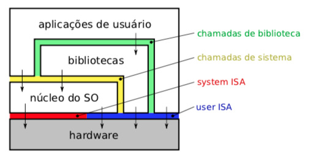
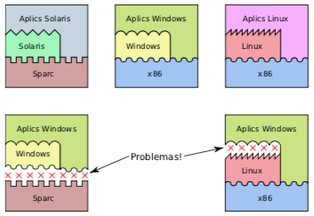
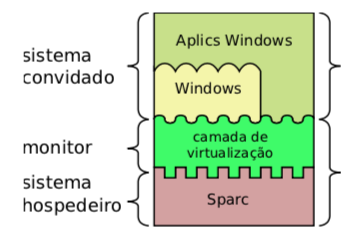
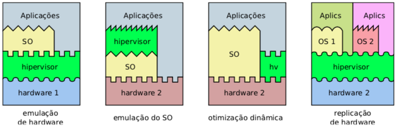

#  Virtual Machine

##  Sumário

1. Breve histórico
2. Conceitos básicos
3. Construção de máquinas virtuais
4. Tipos de máquinas virtuais
5. Técnicas de virtualização

##  Breve histórico

- 1960, IBM com o SO M44/44X e sistemas comercias virtualizados como OS/370
  - Cada usuário tinha virtualizado um sistema monousário com hardware, sistemas operacional e aplicativos
- 1970, 
  - Popek & Goldberg formalizam vários conceitos associados a máquinas virtuais
  - Experiências com ambiente UCSD p-System onde programas em Pascal são compilados para hardware abstrato (P-Machine)
- 1980 -> computadores pessoais de baixo custo, IBM PC
  - Mito do DOS
- 1990 -> VMware, Java e PC de melhor desempenho
- 2010 -> DevOps com _Containeres_ ([vagrant](https://www.vagrantup.com), [docker](https://www.docker.com), [LXC](https://linuxcontainers.org))

##  Conceitos básicos

###  Interface do sistema

**níveis de abstração**:
- Conjunto de instruções (ISA Instruction Set Architecture)
  - Instruções de usuário (User ISA)
  - Instruções do sistema (System ISA)
- Chamadas do sistema (syscalls UNIX, API Application Programming Interface WIN)
- Chamadas de biblioteca (libcalls UNIX, DLLs WIN)

**Compatibilidade entre interfaces**
- Premissas:
  - Sistemas operacinais somente funcionam se projetados e compilados de forma a respeitar ISA de uma plataforma de hardware
  - Aplicativos somente funcionam se projetos de forma a respeitar as interfaces do SO (syscalls) e da plataforma de hardware (User ISA)
- Interface Binária de Aplicação (ABI Application Binary Interface) = syscalls + User ISA

**problemaas das incompatibilidade entre interfaces**
- Baixa portabilidade
- Barreira de inovação
- Otimizações intercomponentes

###  Máquina virtual

- virtualização das interfaces
- componentes de virtualização
  - sistema convidado, ou virtual (guest system)
  - monitor ou hipervisor (virtual machine monitor VMM)
  - sistema hospedeiro, real, ou nativo (host system)

###  Emulação

- **Emulação** é uma forma de virtualização, onde o hipervisor virtualiza integralmente uma interface de hardware ou de sistema operacional
  - Exemplo a JVM

###  Abastração

- no contexto de sistemas operacionais
  - **virtualização** consiste em criar novas interfaces a partir das interfaces existentes
  - **abstração** dos recursos é construída de forma incremental, em níveis de abstração crescentes, que seja mais simples de usar e menos dependente das tecnologias subjacentes

##  Construção de máquinas virtuais

**definição formal** by Gerald Popek (UCLA) and Robert Goldberg (Harvard), 1974: "Uma máquina virtual é vista como uma duplicata eficiente e isolada de uma máquina real. Essa abstração é construída por um “monitor de máquina virtual” (VMM - Virtual Machine Monitor)."

Noutras palavras, **virtualização** consiste em reescrever uma ou mais interfaces do sistema computacional, para oferecer novas interfaces e assim permitir a execução de sistemas operacionais ou aplicações incompatíveis com as interfaces originais.

**propriedades do hipervisor**: 
- básicas: equivalência, controle de recursos, eficiência
- desejáveis: isolamento, recursividade, inspeção

##  Formas e tipos de máquinas virtuais

- Formas
  - **Virtualização de hardware** ou virtualização completa
    - Inclui todo o conjunto de instruções ISA
    - Exemplo JVM
  - **Virtualização de interface do sistema**
    - Inclui apenas System ISA
    - Abordagem clássica de virtualização
    - Utilizada em sistemas de grande porte (mainframe)
    - Exemplo VMWare,  VirtualPC, Xen
  - **Virtualização de dispositivos de entrade/saída**
    - Virtualiza dispositivos  físicos permitindo interação com mundo exterior
    - Exemplo, a maioria das VMs usam para fornecer discos e interfaces de rede virtuais
  - **Virtualização de sistema operacioal**
    - Virtualiza o conjunto de recursos lógicos oferecidos pelo sistema operacinoal
    - Cada máquina virtual pode ser visto como uma instância distinta de um mesmo sistema operacional
    - Exemplos: FreeBSD Jails, Linux VServer, Solares Zones
  - **Virtualização de chamadas de sistema**
    - Permite oferecer o conjunto de syscalls de um sistema operacional host para um sistema operacional convidado
    - Exemplo: [WineHQ](https://www.winehq.org) aplicações WIN exectutando em um UNIX
  - **Virtualização de chamadas de bibliotecas**
    - Similar a _virtualização de chamadas de sistemas_

- **Tipos de VMs**
  - **Máquinas virtuais de processo** (_Process Virtual Machine_) ou máquinas virtuais de aplicações
    - Prover ambiente para execução de um processo (aplicação convidada)
    - JVM
  - **Máquinas virtuais de sistema operacional** (_Operating System Virtual Machine_)
    - Suporte a espácos de usuários distintos sobre um mesmo sistema operacional
    - Compartilham o mesmo núcleo mas cada ambiente tem seus próprios recursos lógicos
    - Exemplo: em teoria os containeres Vagrant, docker e LXC
  - **Máquinas virtuais de sistema** (_System Virtual Machine_)
    - Emular completamente plataformas de hardware, incluindo processadores e periféricos
    - Suporta sistemas operacionais convidados
    - Exemplo: Virtual Box e VMWare

_outra classificação_:
- Interfaces equivalentes
- Interfaces distintas

###  Máquinas virtuais de sistema

**Arquiteturas hipervisores**
1. **Hipervisor nativo** ou Tipo I
  - Exemplos: IBM OS/370, VMWare ESX Server, Xen
2. **Hiperviros convidado** ou Tipo II
  - Exemplos: VMWare Workstation, Virtual Box, QEMU

